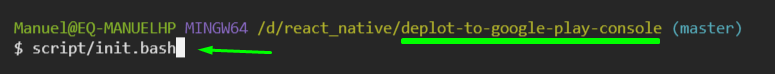

# Configuración inicial

Ejecutar el siguiente `script.bash` dentro de `git bash` en caso de tener **Node** instalado

```bash
script/env.bash
```

Ejecutar los siguientes `script.bash` dentro de `git bash` en caso de no tener **Node** instalado

**Importante:** En caso ocurrir algún problema, ejecutar `git bash` en modo administrador

```bash
# primero -> Se abrirá una ventana pidiendo instalar nvm, no se require ninguna configuración especial, presionar "next o siguiente" hasta finalizar la instalación
script/install-nvm.bash

# segundo -> Se configurará la versión de node 16.14.0, la ultima versión con soporte duradero
script/setting-nvm.bash

# tercero
script/env.bash
```

Ejemplo:


Después de ejecutar el script `env.bash` se creara el archivo `.env`, dentro de el se deberá agregar las credenciales de la cuenta asociada a **Google Play Console**

Ejemplo

```env
EMAIL=your@email.com
PASS=yourPAss
```

Luego deberá ejecutar el comando

```
npm start
```
